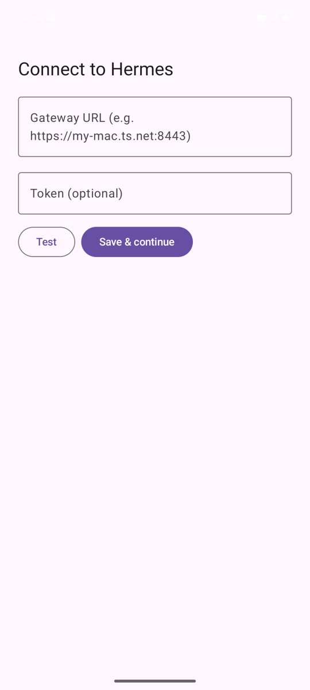
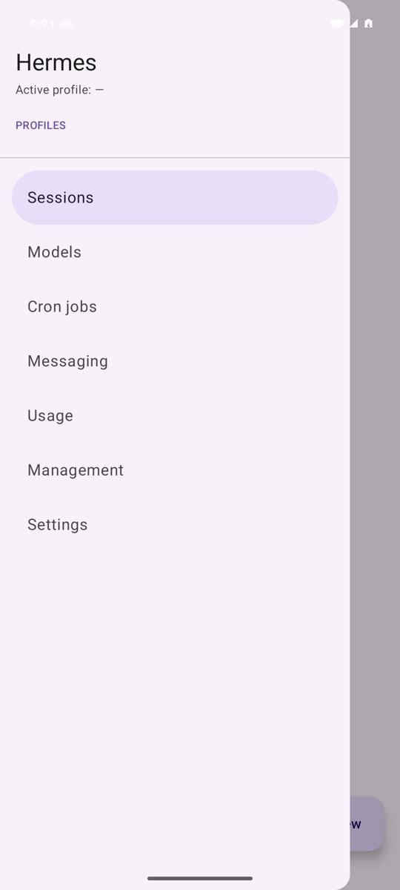
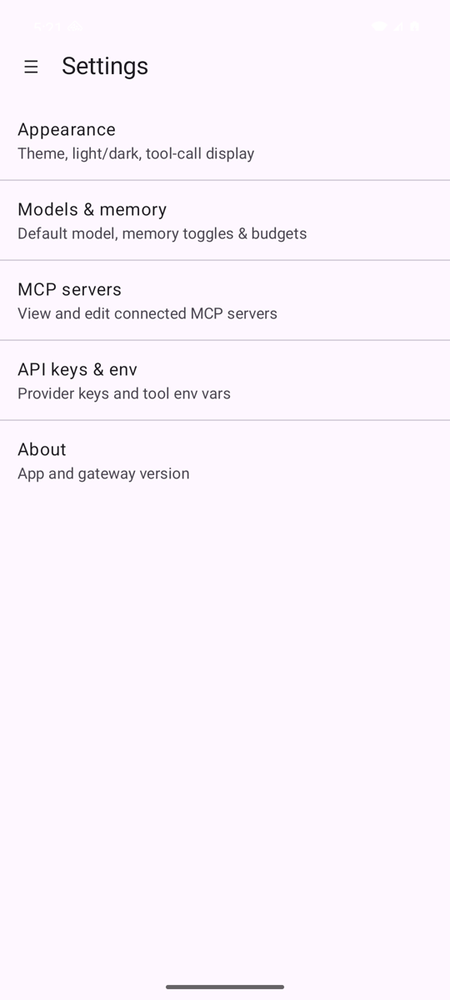
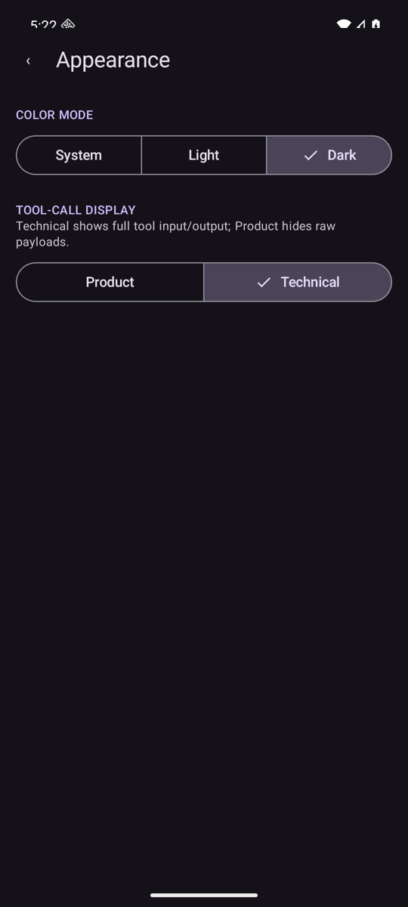

# Hermes for Android

> 💜 **Enjoying Hermes for Android?** [**☕ Support development on Ko-fi →**](https://ko-fi.com/andrew65386) — donations fund new features and keep the project alive. (GitHub Sponsors coming soon.)

[](https://ko-fi.com/andrew65386)
[](LICENSE)

A native Android client for the **Hermes agent gateway** — a phone-friendly companion to
the Hermes Desktop app. It connects to a remote Hermes gateway over Tailscale or another
VPN — or your local network — and gives you full chat plus the management surface: sessions, models,
profiles, scheduled jobs, usage analytics, messaging integrations, and settings.

Built with Kotlin and Jetpack Compose (Material 3).

---

## Download & install

**[⬇️ Download the latest APK](https://github.com/adebnar/hermes-android/releases/latest)**

No build tools or developer setup needed — just grab the signed APK from the
[latest release](https://github.com/adebnar/hermes-android/releases/latest) and install it
on your phone:

1. On your Android phone, open the release link above and tap the `.apk` file to download it.
2. When prompted, allow installs from your browser or Files app ("Install unknown apps").
3. Open the downloaded `.apk` and tap **Install**.
4. Launch **Hermes** and complete the one-time [setup](#first-run-setup) (gateway URL + token).

> The APK is signed with the project's release key. Because it's installed outside the
> Play Store, Android may warn about an app from an unknown developer — that's expected.

---

## Screenshots

<p align="center">
  
  
  
  
</p>

---

## Features

- **Chat** — streaming responses, model picker, slash commands (`/…`) with an inline
  command palette, `@` file mentions/path completion, image attachments, tool-call
  approval and clarification prompts.
- **Sessions** — grouped by workspace, with pinning and a session-admin view.
- **Models & profiles** — switch the active model or tenant profile on the fly; the active
  profile is shown in the chat top bar.
- **Cron** — list, create, edit, pause/resume, run-now, and delete scheduled jobs, with
  next-run times and run history.
- **Usage** — daily token chart and per-model breakdown.
- **Messaging** — enable/disable platform integrations with a guided setup flow for the
  required credentials.
- **Settings** — appearance (System/Light/Dark + tool-call verbosity), memory, MCP
  servers, and API keys/environment variables. Configuration edits are written to the
  live gateway config.
- **Reliability** — automatic reconnect with offline banner and manual retry; expired
  tokens route back to the setup screen.

---

## Architecture

| Layer | Notes |
|-------|-------|
| UI | Jetpack Compose + Material 3, `ModalNavigationDrawer` wrapping a Navigation-Compose `NavHost` |
| State | MVVM — `ViewModel` + `StateFlow`, `collectAsStateWithLifecycle` |
| DI | Hilt |
| Networking | OkHttp — REST over HTTP and a WebSocket JSON-RPC stream to the gateway |
| Local storage | DataStore (device-local prefs: token, theme, tool-call display) |

Package layout under `app/src/main/java/com/hermes/client/`:

```
data/        network clients, repositories, DTOs
di/          Hilt modules
domain/      app models (ChatMessage, Role, …)
ui/          one package per screen (chat, sessions, cron, usage,
             messaging, models, profiles, settings, setup, admin, tools, nav, theme)
```

The launcher icon is an adaptive icon at `app/src/main/res/mipmap-anydpi-v26/`: the
Hermes Agent mascot (black line art on white, matching the desktop app). The foreground
is a PNG mipmap (`mipmap-{m,h,xh,xxh,xxxh}dpi/ic_launcher_foreground.png`) rather than a
vector — the source artwork is too path-dense for the runtime vector parser, which fails
to inflate it and falls back to the default system icon. The background is a solid-white
vector in `app/src/main/res/drawable/`.

---

## Requirements

- Android Studio (bundled JBR / JDK 21)
- Android SDK with `compileSdk` 36 / build-tools 36.x
- A reachable Hermes gateway and a session token

Toolchain is pinned in `gradle/libs.versions.toml`: AGP 8.13.2, Kotlin 2.2.21,
Gradle 8.14.5. `minSdk` 26, `targetSdk` 36.

---

## Building

### Debug

```bash
export JAVA_HOME="/Applications/Android Studio.app/Contents/jbr/Contents/Home"
./gradlew :app:assembleDebug
# → app/build/outputs/apk/debug/app-debug.apk
```

### Release (signed)

Release signing reads a **gitignored** `keystore.properties` at the repo root:

```properties
storeFile=keystore/hermes-release.jks
storePassword=********
keyAlias=hermes
keyPassword=********
```

If that file is absent (fresh clone, CI without secrets) the release build still
succeeds but is left unsigned. To create a keystore:

```bash
keytool -genkeypair -v \
  -keystore keystore/hermes-release.jks \
  -alias hermes -keyalg RSA -keysize 2048 -validity 10000
```

Then build:

```bash
export JAVA_HOME="/Applications/Android Studio.app/Contents/jbr/Contents/Home"
./gradlew :app:assembleRelease
# → app/build/outputs/apk/release/app-release.apk
```

The keystore, `keystore.properties`, and all `*.apk`/`*.aab`/`*.jks` artifacts are
gitignored — signing secrets never enter the repo.

### Install

```bash
adb install -r app/build/outputs/apk/release/app-release.apk
```

---

## First-run setup

On first launch the app shows a **Setup** screen with two fields:

1. **Gateway URL** — where your Hermes gateway is reachable from the phone, e.g.
   `http://100.x.x.x:9119` (its Tailscale address) or `http://192.168.x.x:9119` on the
   same Wi-Fi. See [Connecting](#connecting) below.
2. **Session token** — sent to the gateway as the `X-Hermes-Session-Token` header.

Credentials are stored locally on the device (DataStore). An expired/invalid token
(HTTP 401) routes you back to Setup automatically.

### Getting your Hermes token

The app authenticates to the gateway with its **dashboard session token**. By default the
gateway mints a *new random token every time it starts*, which is awkward to copy. To get a
**stable** token you can paste into the app, set it yourself before starting the Hermes
dashboard / gateway:

```bash
export HERMES_DASHBOARD_SESSION_TOKEN="choose-a-long-random-string"
# then start the Hermes dashboard / web gateway as usual
```

Use that same value as the **Session token** in the app's Setup screen. Treat it like a
password — anyone with the token and network access to the gateway can drive your agent.

📖 Full Hermes installation, gateway, and token docs:
**[hermes-agent.nousresearch.com/docs](https://hermes-agent.nousresearch.com/docs/)**

### Connecting

Reach the gateway from your phone over **Tailscale** (recommended — works from anywhere),
**another VPN that puts the phone and gateway on the same private network** (e.g. a
self-hosted WireGuard or ZeroTier mesh), or your **local network (LAN)** when both are on
the same Wi-Fi.

> Note: this means a *mesh / private* VPN that actually routes to your gateway. A commercial
> **exit VPN** (e.g. Proton VPN, Mullvad) only tunnels your traffic to the public internet
> and **cannot** reach a private gateway — it's not a substitute for Tailscale.

---

## Tests

```bash
./gradlew :app:testDebugUnitTest          # JVM unit tests
./gradlew :app:connectedDebugAndroidTest  # instrumented (device/emulator)
```

---

## Development & release workflow

**Branches**

| Branch | Role | Distribution |
|--------|------|--------------|
| `master` | Production / stable. Always releasable. | Stable releases (`v1.2.3`) |
| `develop` | Beta / integration. New features land here first. | Beta pre-releases (`v1.2.3-beta.1`) |
| `feature/*` | Short-lived work branches. | — (open a PR into `develop`) |

Day-to-day flow:

```
feature/x ──PR──▶ develop ──(stabilize)──▶ master
                    │                         │
              beta pre-release          stable release
              v0.2.0-beta.1               v0.2.0
```

1. Branch from `develop`: `git switch develop && git switch -c feature/my-change`.
2. Open a PR into `develop`. CI (`.github/workflows/ci.yml`) builds and unit-tests every push/PR.
3. Cut a **beta** for testers: tag a commit on `develop`, e.g. `git tag v0.2.0-beta.1 && git push --tags`.
4. When stable, merge `develop` → `master` and tag the release: `git tag v0.2.0 && git push --tags`.

**Automated releases** (`.github/workflows/release.yml`) — pushing a `v*` tag builds a
signed APK and publishes a GitHub Release:

- `vX.Y.Z` → **production** release (`assembleRelease`), shown as *Latest*.
- `vX.Y.Z-beta.N` → **beta** pre-release (`assembleBeta`), *not* marked Latest, so
  `releases/latest` keeps pointing at the stable build.

The **beta build installs side-by-side** with production: it has a separate application id
(`com.hermes.client.beta`) and the label **"Hermes Beta"**, so testers can keep the stable
app and try betas without losing it. Anyone who wants the newest changes grabs the latest
*pre-release* APK from the [Releases page](https://github.com/adebnar/hermes-android/releases);
everyone else gets the stable [latest release](https://github.com/adebnar/hermes-android/releases/latest).

**CI signing secrets** — the release workflow signs in CI using these repository secrets
(*Settings → Secrets and variables → Actions*):

| Secret | Value |
|--------|-------|
| `KEYSTORE_BASE64` | `base64 -i keystore/hermes-release.jks` (the whole keystore, base64-encoded) |
| `KEYSTORE_PASSWORD` | keystore (store) password |
| `KEY_ALIAS` | key alias (e.g. `hermes`) |
| `KEY_PASSWORD` | key password |

Until those are set, tag-triggered builds will fail to sign — build/release locally with
`./gradlew :app:assembleRelease` (or `:app:assembleBeta`) instead, which reads the
gitignored `keystore.properties`.

---

## Support this project

If Hermes for Android is useful to you, please consider supporting development:

**[☕ Buy me a coffee on Ko-fi →](https://ko-fi.com/andrew65386)**

[](https://ko-fi.com/andrew65386)

Every contribution helps fund new features and ongoing maintenance. GitHub Sponsors is
coming soon — until then, Ko-fi is the best way to chip in. Thank you! 🙏

---

## License

[GNU General Public License v3.0](LICENSE). You are free to use, study, share, and modify
this software under the terms of the GPL-3.0 — see the [LICENSE](LICENSE) file for the full
text.

Hermes Agent and the Hermes mascot are property of their respective owners; this is an
independent, unofficial Android client.
